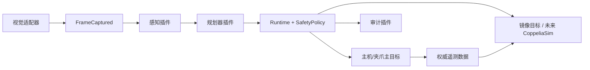
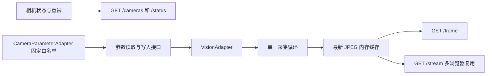

# 运行时架构

## 运行时不变式

- 仅 `Runtime` 可调度指令。任何插件均不持有适配器实例，也不能将指令标记为已授权。
- `SafetyPolicy` 在调度前验证主目标的实时状态、感知数据的有效性、时效性、置信度、坐标系和 PGI 夹爪限位。
- 主目标优先执行。若主目标执行失败，镜像目标不会收到指令。镜像目标失败单独报告，且不会重试主目标。
- 每次主目标成功执行后，镜像目标根据主目标遥测数据进行修正。
- 开发模式重载获取调度锁，停止组件，重载请求的模块，重新读取同一个 JSON 配置文件并启动新组件。生产模式拒绝重载。

## 相机网页预览边界

`gripper_ai_controller.web` 是独立的 ASGI 服务图，只组装一个 `VisionAdapter`、JPEG 编码器、内存帧缓存和可选的 `CameraParameterAdapter` 门面。它不构造 `Runtime`，不读取执行目标，不加载规划/感知/审计插件，不调用安全策略，也不连接机器人或夹爪适配器。相机连接或编码失败时，服务公开标准化的 `degraded` 状态并关闭后重试；它不会把采集画面或错误写入项目存储目录。

HTTP 接口以相机 ID 建模，首版配置只允许一个相机：`/api/cameras`、`/api/cameras/{camera_id}/status`、`/api/cameras/{camera_id}/frame`、`/api/cameras/{camera_id}/stream` 和参数子资源。`GET /parameters` 只读设备实际能力；`PATCH /parameters/{parameter_key}` 只接受 `live` 参数；`POST /parameters/apply` 只接受需要明确保存的 `restart` 参数。未知相机统一返回 `404`，首帧不可用时快照返回 `503`，所有 JSON 错误均使用 `code` 和 `message`。状态和 HTTP 头均不含帧序号。静态构建前端由同一 FastAPI 进程提供，因此生产访问不需要跨域配置。

参数写入由 `web.camera_controls_enabled` 控制，默认关闭，真实开关只能置于 `localstore/` 本机配置；同一开关也阻止启动和重连期间的自动恢复写入。服务和海康适配器使用同一采集操作锁串行化取帧、节点读取、节点写入、停止取流、恢复取流和关闭。设备写入成功后，服务将适配器确认的本次实际值及其必要前置开关原子写回显式 `--config-file` 的根 `camera_parameters`，并在适配器启动或断连重连后的首帧前恢复；恢复失败会公开为可重试的降级状态。若设备写入成功而 JSON 写回失败，接口明确返回“设备已生效、配置未保存”的失败，不会回滚设备参数。适配器只公开固定参数白名单，不暴露厂商客户端、任意 MVS 节点、触发配置或设备持久化设置；服务不会调用 `FeatureSave` 或 `UserSetSave`。安全、可复现的仿真参数可以显式保存在受版本控制的 `configs/`，但真实相机配置与可变 `camera_parameters` 必须放在 Git 忽略的 `localstore/`。

## 适配器合约

每个适配器拥有异步的 `startup()` 和 `shutdown()` 生命周期方法。机器人和夹爪适配器暴露 `initialize`、`get_status`、`execute` 和 `synchronize`。视觉适配器仅通过 `ImageFrame` 暴露 `capture` 和相机健康状态。`CameraParameterAdapter` 是独立的可选端口，返回规范化参数描述并接受经过白名单验证的标量更新；它不改变 `VisionAdapter` 的采集职责。`BaseAdapter` 负责幂等生命周期状态；厂商连接仅在其生命周期钩子中创建或释放。

`RobotStatus` 将初始化状态与 `connected`、`powered`、`enabled` 分开表达。即使适配器已成功登录，安全策略也不会为未来机器人运动授权，除非三项设备状态都为真且机器人无故障、无急停。

每个适配器/插件子包提供一个 `ComponentManifest`，包含其稳定名称、版本、配置键、能力和工厂标识符。项目根 `configs/` 中的 JSON 文件选择已注册组件，`bootstrap/runtime_builder.py` 负责校验和组装活动组件图，而非通过任意代码发现。

## 视觉合约

帧适配器发布相机 ID、时间戳、帧引用/载荷、标定引用和健康状态。`VisionAdapter.on_frame()` 以相机实例为范围注册异步观察者，并只在显式 `capture()` 成功后通知它们；它不启动后台取流，也不替代运行时随后发布的 `FrameCaptured` 事件。感知插件发布标签、2D 框、置信度、`Pose3D` 和抓取候选。

对于固定相机，标定父坐标系为 `robot_base`。对于工具端安装相机，父坐标系为 `tool0`；感知插件使用捕获时的机器人 TCP 状态将物体姿态解算到 `robot_base`。生产适配器必须使用经过标定的刚体变换和真实机器人运动学；内存实现仅使用加法变换用于确定性测试。

## 扩展顺序

1. 为 JAKA 适配器添加受控的本地连接冒烟测试，再单独评审机械臂运动实现。
2. 添加 CoppeliaSim 机器人/夹爪/相机适配器作为镜像目标。
3. 为海康 USB3 Vision 适配器添加受控的单帧硬件验证，再实现标定和断连恢复。
4. 添加 DH Robotics 主适配器与 CoppeliaSim 机器人/夹爪/相机适配器，附带项目本地厂商库。
5. 添加基于模型的感知与结构化输出 LLM 规划插件，仅返回规范化指令。
6. 添加生产配置和受控硬件冒烟测试。
