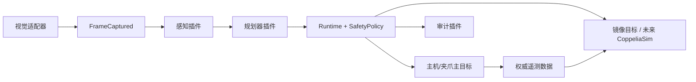
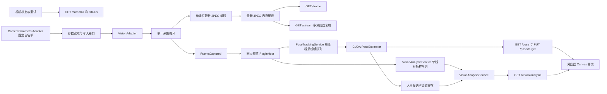
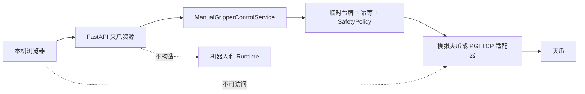
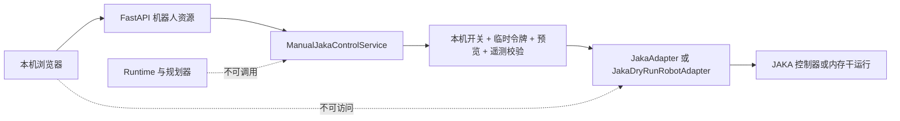
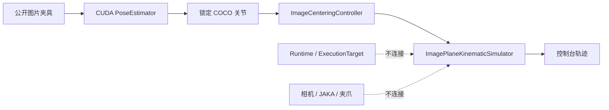

# 运行时架构

## 运行时不变式

- 仅 `Runtime` 可调度指令。任何插件均不持有适配器实例，也不能将指令标记为已授权。
- `SafetyPolicy` 在调度前验证主目标的实时状态、感知数据的有效性、时效性、置信度、坐标系和 PGI 夹爪限位。
- 主目标优先执行。若主目标执行失败，镜像目标不会收到指令。镜像目标失败单独报告，且不会重试主目标。
- 每次主目标成功执行后，镜像目标根据主目标遥测数据进行修正。
- 主机器人可选地提供 `RobotMotionConstraint`。通用安全策略通过后、发布 `CommandAuthorized` 前，运行时使用同一轮遥测调用该约束；约束拒绝时不会向任何主目标或镜像目标分发命令。
- 开发模式重载获取调度锁，停止组件，重载请求的模块，重新读取同一个 JSON 配置文件并启动新组件。生产模式拒绝重载。

## 相机网页预览边界

`gripper_ai_controller.web` 是独立的 ASGI 服务图，默认组装一个 `VisionAdapter`、JPEG 编码器、内存帧缓存、网页预览 `PluginHost` 和可选的 `CameraParameterAdapter` 门面。它不构造完整 `Runtime`、规划/感知/审计插件或镜像目标。声明 `gripper_control` 或 `jaka_control` 时，它才会额外构造各自选中主目标的设备适配器和人工控制门面，以提供只读状态；只有本机配置开启对应网页控制开关后，门面才允许动作。夹爪门面独立调用 `SafetyPolicy.evaluate_gripper`；JAKA 门面使用独立的令牌、预览和关节约束流程。二者都不会启动自动规划或视觉跟随。海康采集、JPEG 编码、CUDA 姿态推理和质量诊断分别使用受限的单工作线程；每条慢路径最多有一个正在处理项和一个可替换的最新待处理项，避免形成历史帧积压。相机连接或取帧失败时，服务公开标准化的 `degraded` 状态并关闭后重试；JPEG 编码失败只标记当前预览降级，后续有效帧仍可发布。它不会把采集画面或错误写入项目存储目录。

可选的 `PoseTrackingService` 位于同一只读服务图中，但与相机 SDK 和运动运行时隔离。它从已获取的 `ImageFrame` 接收单个内存帧，在独立单工作线程中按 `pose.max_inference_fps` 至多运行一个 CUDA `PoseEstimator`，正在推理时只替换一个最新待处理帧。`TorchvisionKeypointRcnnEstimator` 会按 `pose.inference_max_side`（默认 `768`）等比缩图，并同步限制 Torchvision 内部图像变换，防止模型再次放大输入；随后将模型框和关键点映射回原始相机坐标。首版以最高置信度选择一人，再验证当前锁定 COCO 关节；人物或关节置信度不足即发布无效状态。启用姿态时，应用在启动采集前校验 CUDA 11.7 Torch 可用，不会回退到 CPU。`GET /pose` 还提供 `latest_frame_at` 和 `overlay_fresh`；浏览器底图始终使用 MJPEG，只有来源帧与最新预览帧差值不超过 `overlay_max_frame_lag_seconds` 时才绘制 Canvas 叠加。修改锁定关节通过 `PUT /pose/target` 写回显式本机配置；两者都不触发机器人命令。

`VisionAnalysisService` 是只读门面：采集循环把质量诊断提交到有界内存缓存，姿态服务仍是唯一的 CUDA 推理调度者。质量检查先按 `vision_analysis.sample_max_side`（默认 `640`）缩采样，再在专用单工作线程中以 `max_analysis_fps`（默认 `1`）执行；忙碌时只保留最新待分析帧。`GET /vision/analysis` 将帧健康、已通过人体阈值的候选框、主人体和 COCO 关节可见性组合为稳定响应，不调用相机、不排队推理、不加载第二个人体检测模型。质量警告不会修改曝光、停止取流或阻断预览。离线 `vision-evaluate` 使用相同的质量与可见性策略读取受版本控制的公开图片，并分别走 RGB8 与确定性 Mono8 输入路径；它不构造网页或运行时图。

## 网页预览 Plugin 主机

网页 Plugin 通过 `components.plugins.preview` 显式配置，由 `PluginHost` 维护独立于 `Runtime` 的生命周期。采集循环在 JPEG 发布后投递 `FrameCaptured`；Plugin 只接收这个帧事件，不能取得适配器实例、设备客户端、执行目标或人工控制门面。当前受信任注册表只包含 `visual-pose-analysis`；新增标识必须先在服务端注册固定工厂，配置或浏览器请求不能引入任意 Python 模块。该 Plugin 组合现有姿态追踪和成像分析服务，为既有 `/pose`、`/pose/target` 与 `/vision/analysis` 接口提供只读快照。

`GET /api/plugins` 和 `GET /api/plugins/{plugin_id}/status` 返回已配置 Plugin 的清单和状态；`POST /api/plugins/reload` 只能引用这些稳定 ID，空 `plugin_ids` 表示全部。重载时主机会暂停相应 Plugin 的帧分发、等待活动任务结束、启动替换实例后原子切换；新实例失败则继续保留旧实例。相机采集、最新 JPEG 缓存和 MJPEG 主画面在整个过程中不被重建。

只有 `runtime_mode: "development"`、`web.bind_host: "127.0.0.1"` 和 `web.plugin_reload_enabled: true` 同时满足时，接口才允许重载。生产模式以及非回环监听地址必须拒绝重载并要求服务重启；该限制与夹爪/JAKA 的本机人工控制限制独立，不能通过浏览器请求放宽。

## 网页夹爪人工控制边界

人工控制只在 `127.0.0.1` 绑定且本机配置显式启用时存在。`ManualGripperControlService` 是唯一能够调用 `operator_initialize()` 和 `execute()` 的网页层对象：它要求工作区清空及现场独立急停确认，生成 60 秒临时令牌，并以 `Idempotency-Key` 缓存操作结果。断连、重新连接、初始化失败和服务关闭都会撤销令牌。位置、力和模拟速度先由配置范围校验，再由核心夹爪安全策略核验连接、初始化、故障、急停和运动中冲突；任何拒绝都发生在适配器前。

`PgiTcpGripperAdapter` 使用项目资料中已验证的固定 TCP 帧，仅支持连接、状态读取、普通初始化、目标力与目标位置。启动时只连接和读取状态。它没有速度、软件停止、`HOLD` 或 `0xA5` 全行程重新标定接口；因此真机页面不会显示这些控件，“立即锁定”也只撤销后续网页授权，设备运动异常必须使用现场独立急停。

## 网页 JAKA 六轴人工控制边界

`ManualJakaControlService` 是与自动运行时并列的人工操作门面。普通 `JakaAdapter.execute()` 继续拒绝真实运动，因此插件、规划器和 `Runtime` 无法通过通用调度路径绕过控制。服务只接受一个选中的 `primary` JAKA 目标；启动或“重新连接”仅创建会话、登录并读取状态，绝不自动调用 `power_on()`、`enable_robot()` 或 `joint_move()`。

真机网页控制必须由 Git 忽略的 `localstore/` 配置显式声明：真实 `controller_ip`、`allow_enable` 和 `allow_manual_motion` 均不进入版本库；`web.jaka_controls_enabled` 为真时服务强制绑定 `127.0.0.1`。模板使用 `jaka-dry-run-robot` 且默认关闭控制，演练流程也应先复制到本机私有文件后再显式开启。

动作流程固定为工作区与独立急停确认、短时令牌、六轴**绝对**目标预览、来源关节角新鲜度校验和第二次明确确认。服务拒绝相对、直线、jog、servo 和非阻塞动作；真机使能仍是独立操作，只能针对已人工上电、无故障、无急停且配置允许的控制器。当前没有网页软件急停，撤销令牌或关闭页面只能阻止未来请求，不能终止正在执行的动作；现场独立急停是唯一的紧急恢复手段。

当前限位模板仅适用于确认与 JAKA Zu 3 一致的现场型号。真实测试还必须完成 SDK/控制器兼容性、工具与负载、安装姿态、工作区、障碍物与急停检查；网页不能修改控制器安全参数、碰撞等级、网络异常行为或现场限位。

## 离线图像居中仿真边界

`image_servo_simulation/` 是与网页预览、运行时和设备适配器平行的纯计算包。`ImageCenteringController` 将归一化二维误差经阻尼最小二乘和每轴限幅转换为虚拟关节增量；`ImageServoSimulationSession` 使用受版本控制的 `2 x 6` 图像雅可比预测同一静态图片中的关节如何向中心收敛。它不生成 `RobotCommand`、不启动 `Runtime`、不调用 `RobotAdapter.execute()`，也不打开相机或网络客户端。

会话可接收同一相机、同一锁定关节的严格递增二维观测，并将人物的图像位移叠加到当前虚拟投影后进行下一步计算；这为后续受控的实时集成保留输入边界。它不会自行订阅 `PoseTrackingService`，以保证网页预览仍是只读服务且不会产生控制链。

该雅可比、六轴名称和关节限位仅是离线可复现实验参数。未来真机图像伺服必须在独立规划与安全设计中引入现场相机/工具标定、真实运动学、在线图像反馈、速度和加速度限制、工作空间、碰撞和人机距离保护、目标丢失停机及显式授权；不可将当前控制台轨迹直接映射到物理关节。

HTTP 接口以相机 ID 建模，首版配置只允许一个相机：`/api/cameras`、`/api/cameras/{camera_id}/status`、`/api/cameras/{camera_id}/frame`、`/api/cameras/{camera_id}/stream` 和参数子资源。`GET /parameters` 只读设备实际能力；`PATCH /parameters/{parameter_key}` 只接受 `live` 参数；`POST /parameters/apply` 只接受需要明确保存的 `restart` 参数。未知相机统一返回 `404`，首帧不可用时快照返回 `503`，所有 JSON 错误均使用 `code` 和 `message`。状态和 HTTP 头均不含帧序号。声明人工控制段后，夹爪资源位于 `/api/grippers`，JAKA 资源位于 `/api/robots`；后者以状态、短时授权、显式使能、关节预览和已确认动作建模，所有动作错误继续使用 `code` 和 `message`。静态构建前端由同一 FastAPI 进程提供，因此生产访问不需要跨域配置。

参数写入由 `web.camera_controls_enabled` 控制，默认关闭，真实开关只能置于 `localstore/` 本机配置；同一开关也阻止启动和重连期间的自动恢复写入。服务和海康适配器使用同一采集操作锁串行化取帧、节点读取、节点写入、停止取流、恢复取流和关闭。海康网页预览默认配置 `frame_delivery_mode: latest_only`，在 MVS 相机句柄打开、开始取流前设置 `MV_GrabStrategy_LatestImagesOnly`；已连接 USB 相机在开始取流后调用该 API 会返回调用顺序错误。策略设置失败会阻止该次取流并显式报错，绝不静默退回 FIFO。设备写入成功后，服务将适配器确认的本次实际值及其必要前置开关原子写回显式 `--config-file` 的根 `camera_parameters`，并在适配器启动或断连重连后的首帧前恢复；恢复失败会公开为可重试的降级状态。若设备写入成功而 JSON 写回失败，接口明确返回“设备已生效、配置未保存”的失败，不会回滚设备参数。适配器只公开固定参数白名单，不暴露厂商客户端、任意 MVS 节点、触发配置或设备持久化设置；服务不会调用 `FeatureSave` 或 `UserSetSave`。安全、可复现的仿真参数可以显式保存在受版本控制的 `configs/`，但真实相机配置与可变 `camera_parameters` 必须放在 Git 忽略的 `localstore/`。

## 适配器合约

每个适配器拥有异步的 `startup()` 和 `shutdown()` 生命周期方法。机器人和夹爪适配器暴露 `initialize`、`get_status`、`execute` 和 `synchronize`。`RobotAdapter.get_joint_positions()` 返回带时间戳的六轴弧度关节角快照；默认实现从 `get_status()` 提取，具备专用厂商读取接口的适配器可以覆盖它。视觉适配器仅通过 `ImageFrame` 暴露 `capture` 和相机健康状态。`CameraParameterAdapter` 是独立的可选端口，返回规范化参数描述并接受经过白名单验证的标量更新；它不改变 `VisionAdapter` 的采集职责。`BaseAdapter` 负责幂等生命周期状态；厂商连接仅在其生命周期钩子中创建或释放。

需要网页人工控制的夹爪实现 `OperatorControllableGripper`。该端口在普通 `initialize()` 之外显式区分 `operator_initialize()`、`reconnect()`、控制模式和能力标志；生命周期初始化必须保持无运动。真机适配器可将 `supports_speed` 或 `supports_stop` 设为 `false`，使 API 和前端在命令下发前拒绝未验证能力。

`RobotStatus` 将初始化状态与 `connected`、`powered`、`enabled` 分开表达。即使适配器已成功登录，安全策略也不会为未来机器人运动授权，除非三项设备状态都为真且机器人无故障、无急停。

`JakaAdapter.get_joint_positions()` 覆盖默认实现，直接调用 JAKA SDK `get_joint_position()`，将成功响应中的 `J1` 至 `J6` 映射为弧度值，并拒绝缺失、非六维或非有限遥测数据。`jaka-joints` CLI 只构造和启动选定的 JAKA 适配器，执行 `login -> get_joint_position -> logout`，不会构造 `Runtime`、启动相机或夹爪、使能、上电或发送运动指令。该接口只读取关节空间坐标；六个实体关节在 `robot_base` 中的三维位置需要独立的型号运动学模型，不能从该 SDK 接口直接推导。

真实 `JakaAdapter` 的通用 `execute()` 始终拒绝运动。仅 `ManualJakaControlService` 可在本机开关、临时令牌、工作区和独立急停确认、实时状态、绝对六轴预览以及二次确认全部通过后调用 `operator_joint_move()`。该窄化入口固定阻塞语义，拒绝相对、直线、jog、servo 和非阻塞动作；它不具备自动上电或网页软件急停能力。`allow_enable` 与 `allow_manual_motion` 是本机私有配置中的独立适配器级权限，不能由浏览器请求修改。

`JakaDryRunRobotAdapter` 是独立于真实 SDK 的内存主目标，可编译 `MOVE_JOINTS` 的绝对模式（SDK 模式 `0`）和相对模式（SDK 模式 `1`），并固定为阻塞调用预览 `joint_move(关节值, 模式, True, 速度)`。它也可预览 `STOP -> motion_abort()`，但不会改变预测关节角。编译器采用 JAKA Zu 3 物理范围及更保守的默认软件范围：各轴在物理边界内收缩 `10°`、最高 `0.5 rad/s`、单轴单步最高 `10°`；本机配置只能继续收紧。干运行目标将同一编译器暴露为 `RobotMotionConstraint`，因此越界、非有限、速度异常、步长过大、非六轴或不支持的机器人动作会在任何分发前被拒绝。它从不导入 `jkrc`、创建控制器连接、上电、使能或调用 SDK 运动方法；真实 `JakaAdapter.execute()` 仍拒绝所有运动。

每个适配器/插件子包提供一个 `ComponentManifest`，包含其稳定名称、版本、配置键、能力和工厂标识符。项目根 `configs/` 中的 JSON 文件选择已注册组件，`bootstrap/runtime_builder.py` 负责校验和组装活动组件图，而非通过任意代码发现。

## 视觉合约

帧适配器发布相机 ID、时间戳、帧引用/载荷、标定引用和健康状态。`VisionAdapter.on_frame()` 以相机实例为范围注册异步观察者，并只在显式 `capture()` 成功后通知它们；它不启动后台取流，也不替代运行时随后发布的 `FrameCaptured` 事件。感知插件发布标签、2D 框、置信度、`Pose3D` 和抓取候选。

对于固定相机，标定父坐标系为 `robot_base`。对于工具端安装相机，父坐标系为 `tool0`；感知插件使用捕获时的机器人 TCP 状态将物体姿态解算到 `robot_base`。生产适配器必须使用经过标定的刚体变换和真实机器人运动学；内存实现仅使用加法变换用于确定性测试。

## 扩展顺序

1. 完成真实 JAKA 网页控制的受控现场验收：本机显式授权、只读状态预检、型号与现场限位确认、到位与超时轮询、`motion_abort` 恢复策略、碰撞验证及 CoppeliaSim 验证均为前置条件。
2. 添加 CoppeliaSim 机器人/夹爪/相机适配器作为镜像目标。
3. 为海康 USB3 Vision 适配器添加受控的单帧硬件验证，再实现标定和断连恢复。
4. 添加 DH Robotics 主适配器与 CoppeliaSim 机器人/夹爪/相机适配器，附带项目本地厂商库。
5. 添加基于模型的感知与结构化输出 LLM 规划插件，仅返回规范化指令。
6. 添加生产配置和受控硬件冒烟测试。
