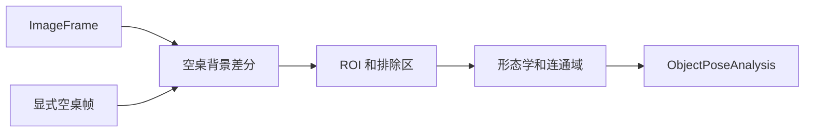

# 已知工件二维位姿

本包实现固定相机、固定照明和空桌背景条件下的被动二维前景分析。它只消费已经规范化的 `ImageFrame`，不访问海康 SDK、不打开相机、不写入原始画面，也不导入 JAKA、夹爪或安全策略。Pillow 负责 RGB8/Mono8 输入归一化，NumPy 负责掩码和坐标转换，已锁定的 `opencv-contrib-python-headless` 负责形态学、连通域、轮廓和矩计算，避免在 5MP 工业图像上进行 Python 逐像素遍历。

## 公共边界

- `ForegroundObjectPoseEstimator`：背景差分、ROI、排除区、二值开闭运算、OpenCV 连通域、轮廓、几何筛选和主轴计算的默认实现。
- `ObjectPoseEstimator`：后续替换为训练模型或更强几何算法时应保持的同步分析协议。
- `ObjectPoseSettings`：仅含可版本化的阈值、ROI 与静态排除区；真实空桌帧必须由上层从 `localstore/` 显式加载后传给构造器。
- `KnownWorkpieceProfile`：`known-workpiece-v1` 的面积、长宽比、填充率、实心度、头尾规则，以及现场量取的名义长宽、厚度和抓取原点。



## 输出含义

`ObjectPoseCandidate` 的轮廓、外接框与中心均处于图像二维坐标系：轮廓和外接框是归一化坐标，`pixel_center` 是源图像像素坐标。`yaw_rad` 是轮廓主轴方向，使用 `yaw_period_rad == pi` 明确表示头尾未区分；它不是完整的 3D/6D 姿态，也不能直接生成机械臂命令。

只有一个候选、轮廓符合档案且主轴足够明确时，`ObjectPoseAnalysis.valid` 才为真。`KnownWorkpieceProfile.directional_feature` 默认是 `none`，因此若 `require_directional_yaw` 为真会返回 `directional_yaw_ambiguous`。首期只允许经现场样本确认的 `larger_end` 规则：主轴两端外侧 20% 的轮廓占据量差达到 `minimum_directional_asymmetry` 时，才输出 `yaw_period_rad == 2*pi`；否则仍拒绝单向夹取。

运行时投影层会在档案提供 `nominal_length_mm` 和 `nominal_width_mm` 后，将轮廓投影回板平面并比对 `maximum_planar_dimension_error_ratio`。尺寸不符会返回 `planarity_suspected`，它表示倾斜、遮挡、与夹具粘连或错误物体等不可区分的风险，绝不输出 JAKA 基座坐标。`object_thickness_mm` 与明确的 `grasp_height_mm` 约束台面上方的推导 Z；非零 `grasp_origin_offset_x_mm/y_mm` 必须要求完整偏航，坐标以轮廓中心为原点、`x` 沿头尾方向、`y` 向左。

## 最小用法

```python
from gripper_ai_controller.object_pose import ForegroundObjectPoseEstimator, ObjectPoseSettings

estimator = ForegroundObjectPoseEstimator(ObjectPoseSettings(), empty_table_frame)
result = estimator.analyze(current_frame)
if result.valid:
    candidate = result.candidates[0]
    print(candidate.pixel_center, candidate.yaw_rad, candidate.yaw_period_rad)
```

背景帧必须与当前帧来自相同 `camera_id` 且拥有相同分辨率。相机切换、重装、裁切或重标定后必须重新建立背景和上层标定，不能复用旧结果。多候选、相机切换、背景尺寸不一致、过大前景、圆形或近圆形物体也都会返回明确原因码而不是猜测位姿。

## 验证

在项目根目录使用 Windows 入口运行：

```powershell
scripts\test.bat tests.test_object_pose -v
```

该测试只生成内存中的 RGB8/Mono8 合成帧，不访问相机、机器人、夹爪或网络。
