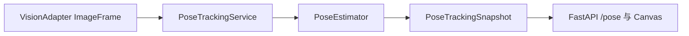

# 人体姿态感知

本包为相机网页预览提供单人 2D 骨架与关节锁定能力。它只消费已经规范化的 `ImageFrame`，只向网页服务发布结构化姿态结果；不访问海康 MVS SDK、不创建机器人或夹爪适配器，也不发送任何运动指令。

## 组成

- `models.py`：COCO 17 关节名称、骨架连线和稳定的数据契约。
- `estimator.py`：`PoseEstimator` 协议与 CUDA 专用的 `TorchvisionKeypointRcnnEstimator` 实现。
- `tracker.py`：单人选择、关节置信度过滤、丢失状态、相邻有效帧的 2D 关节运动状态和非阻塞推理调度。
- `config_store.py`：仅原子写回用户选择的 `pose.target_joint`。
- `gpu.py`：不加载模型的 NVIDIA/CUDA/Torch 就绪检查。

`PoseEstimator` 是这里唯一的模型替换点。后续接入 MMPose 或其他推理后端时，应实现相同的 `infer(ImageFrame) -> Tuple[PoseCandidate, ...]` 协议，而不能让新模型直接调用相机 SDK 或网页路由。



## 单色图像与模型

首版固定使用 `torch==1.13.1`、`torchvision==0.14.1` 的 CUDA 11.7 构建，以及官方 COCO `Keypoint R-CNN ResNet50-FPN` 权重。海康单色帧必须已由适配器规范化成 `mono8`；推理前由 Pillow 原生路径复制为三个相同通道，不使用 Python 逐像素循环。该转换保留亮度信息，并不把单色相机伪造成彩色相机。

为避免 2448×2048 等高分辨率帧拖慢预览，模型输入按 `pose.inference_max_side` 等比缩小，默认最长边为 `768`；预处理和 Torchvision 内部图像变换使用同一上限，避免默认检测模型再次把输入放大。模型框和关节坐标会严格缩放回原始相机像素坐标。`PoseTrackingService` 使用独立的单工作线程：正在推理时只保留最新待推理帧，旧待处理帧会被替换。默认 `max_inference_fps` 为 `2`，`torch_cpu_threads` 与 `torch_interop_threads` 分别为 `2`、`1`，用于限制 GPU 推理周边的 CPU 线程竞争。

模型不会在启动时自动下载。先在项目根目录检查环境：

```powershell
poetry run gripper-ai-controller gpu-check
poetry install
poetry run gripper-ai-controller gpu-check --require-torch
poetry run gripper-ai-controller pose-download-weights --weights-file localstore/models/keypointrcnn_resnet50_fpn_coco.pth
```

只有第三个命令确认 CUDA 11.7 Torch 可用后，启用 `pose.enabled` 的网页服务才能启动。权重文件必须保持在被 Git 忽略的 `localstore/`，配置中的 `weights_path` 必须是以 `localstore/` 开头、且不包含 `..` 的相对路径。

## 配置与锁定

从 `configs/pose-preview.example.json` 复制配置到 `localstore/`，补充实际相机适配器设置、权重路径并将 `pose.enabled` 设为 `true`。`PUT /api/cameras/{camera_id}/pose/target` 会把合法的 COCO 关节名写回该显式传入的本机配置，不会写入模型权重、原始画面或骨架历史。

默认锁定 `right_wrist`。当最高置信度人体、目标关节或相机帧不满足配置阈值时，快照立即变为无效状态；不会保留旧坐标作为可继续跟随的目标。

`GET /pose` 除姿态快照外还返回 `latest_frame_at` 与 `overlay_fresh`。浏览器主画面始终保持 MJPEG；仅当姿态来源帧不晚于最新预览帧且时间差不超过 `overlay_max_frame_lag_seconds`（默认 `0.35` 秒）时，Canvas 才叠加骨架和人体框。推理结果过期时只隐藏叠加，不暂停、替换或重连视频流。`/pose/frame` 仅保留为诊断接口，不参与主画面显示。

`pose.motion_speed_threshold` 的默认值为 `0.04`，单位为归一化图像坐标/秒。首帧选择最高置信度人体；之后只有与已锁定人体框满足 `tracking_min_iou` 或 `tracking_max_center_distance` 的候选才会延续同一轨迹。无法关联时，快照立即无效并重建运动基线，避免把两个人的关节差误作为运动。`motion_max_interval_seconds` 默认 `1.5` 秒，超过该时长、采集时间倒退或重复时同样不会计算速度。

仅当同一个已关联锁定关节连续两次推理均有效，`PoseTrackingSnapshot.motion` 才会包含位移、速度和 `moving` 状态；切换关节、目标丢失或关节低置信度都会丢弃基线。这里不是身份重识别系统，人员交叉、长期遮挡或重新进入画面时会保守地中断并重新建立轨迹。它没有三维尺度或控制含义，不能用来生成任何相机或机械臂运动。

## 边界

输出仅是单相机图像平面中的 2D 坐标。它不能提供相对于机器人基座的安全 3D 位置，也不能直接用于机械臂跟随。后续真机控制必须另行完成内参和手眼标定、图像伺服或深度估计、工作空间与速度限制、丢失停机、仿真验证以及显式硬件授权。

## 验证

```powershell
poetry run python -m unittest tests.test_pose tests.test_web -v
pnpm --dir src/web typecheck
```

这些测试只使用假相机、假推理器和 FastAPI 内存客户端，不加载 Torch 模型、不访问 GPU、不连接 JAKA 或夹爪。
