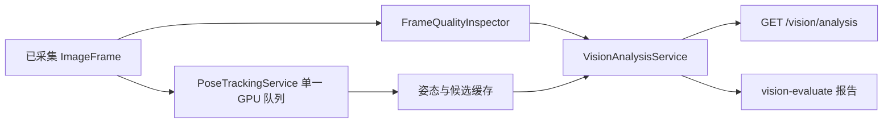

# 视觉分析

本包为相机网页预览提供只读的图像健康、人员检测结果复用、关节可见性和离线图片评测能力。它不导入海康 MVS SDK、不创建 `VisionAdapter`、不启动相机、不连接 JAKA 或夹爪，也不生成机器人指令。

## 模块与职责

- `quality.py`：`FrameQualityInspector` 以 Pillow 原生转换和 NumPy 测量规范化 RGB8/Mono8 帧的亮度均值、对比度和拉普拉斯方差清晰度，只发布警告，不修改相机。
- `analysis.py`：`VisionAnalysisService` 是读取门面，结合已采集帧的质量缓存和既有 `PoseTrackingService` 的推理缓存；不会建立第二条采集或 CUDA 推理路径。
- `models.py`：网页和 API 之间的稳定数据契约，包括 `FrameQualityDiagnostics`、`PersonDetection2D`、`JointVisibility` 和 `VisionAnalysisSnapshot`。
- `fixtures.py`：本地公开图片清单、SHA-256 校验、RGB8/Mono8 读取、离线验收和可选人工复核叠加图。



这是 Facade 的最小使用场景：网页服务需要一个稳定的只读分析入口，但图像质量和已有姿态队列分别有明确所有权。将它们组合在这里可避免新增模型、相机连接或跨层依赖。

## 帧质量与单色输入

适配器必须先将帧规范化为 `rgb8` 或 `mono8` 并填充正确宽高。质量检查不保存像素，只返回以下非阻断警告：低分辨率、过暗/过亮、低对比度、低清晰度、帧不可用、尺寸异常、载荷长度异常或像素格式不支持。为避免诊断抢占高分辨率预览，检查先按 `vision_analysis.sample_max_side`（默认 `640`）缩采样，再在一个独立单工作线程中计算；最多每秒执行 `vision_analysis.max_analysis_fps`（默认 `1`）次，忙碌时只保留最新待分析帧。

Keypoint R-CNN 需要三通道输入。`mono8` 输入由 Pillow 原生复制到三个通道，保持原有亮度但不伪造颜色；任何模型结果均仍是 2D 图像坐标。

## 人员与关节

人员框完全复用 `PoseEstimator.infer()` 的 `PoseCandidate`：`TorchvisionKeypointRcnnEstimator` 已经筛选 COCO 人员类别，`PoseTrackingService` 再应用配置中的人体置信度阈值并选择最高置信度的主人体。不得为网页另行加载人体检测模型。

`JointVisibilityEvaluator` 为每个 COCO 17 关节输出以下一种状态：

- `detected`：像素坐标在画面内，且置信度不低于 `pose.joint_confidence_threshold`。
- `low_confidence`：在画面内但置信度不足。
- `out_of_frame`：像素坐标不在当前帧尺寸内。
- `unavailable`：模型没有返回该关节。

关节状态仅用于浏览器诊断，不能作为机械臂运动输入。

## API 与缓存行为

`GET /api/cameras/{camera_id}/vision/analysis` 只读取内存缓存，响应包含当前帧质量、人员数量、人员框、主人体、关节状态和失败原因。请求不会调用 `capture()`、不会排队推理，也不会返回 JPEG、原始像素或模型张量。未知相机的错误格式保持网页服务通用的 `{ "code", "message" }` 结构。

姿态未启用时，端点仍返回帧质量和 `pose_enabled: false`；这使成像验收不依赖 CUDA 模型。启用后，候选和骨架仍由同一个限频 `PoseTrackingService` 生产。

## 离线评测

`data/vision-fixtures/manifest.json` 中每张图片均有来源、许可、SHA-256、人数与关节门槛、必要成像警告及人工复核说明。运行：

```powershell
poetry run gripper-ai-controller gpu-check --require-torch
poetry run gripper-ai-controller vision-evaluate --config-file configs/vision-evaluation.example.json --report-file temp/gripper-ai-controller/vision-evaluation/report.json --save-overlays
```

评测不创建相机、网页或控制运行时；它只加载本机 `localstore/` 权重和受版本控制的图片。叠加图、报告和人工检查截图只能放在 `temp/gripper-ai-controller/`。

## 扩展边界

后续 MMPose、RTMPose 或其他模型必须实现现有 `PoseEstimator` 协议，以 `ImageFrame` 返回 `PoseCandidate`，而不是接入网页路由或海康 SDK。接入前需单独评估 Python 3.7、CUDA、模型权重许可和离线素材门槛。

单目单色的本包输出只包含 2D 诊断信息。姿态包可为单一锁定关节提供相邻有效帧的图像运动状态，但多人身份锁定、连续身份跟踪、相机标定、CoppeliaSim 验证和任何机械臂跟随控制均不属于本包职责。
